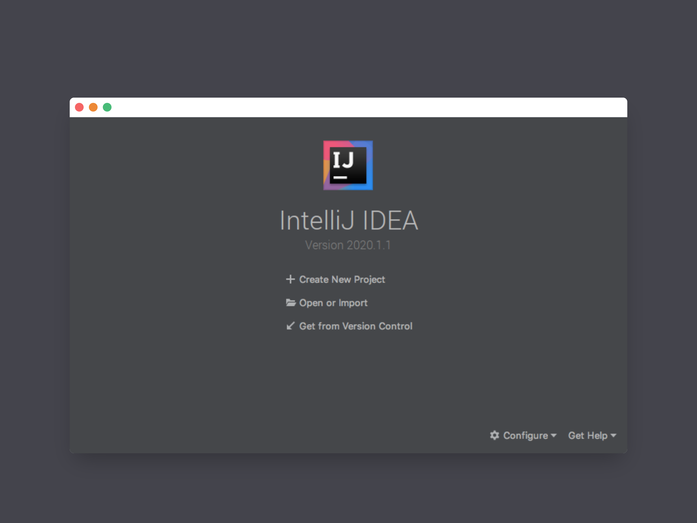
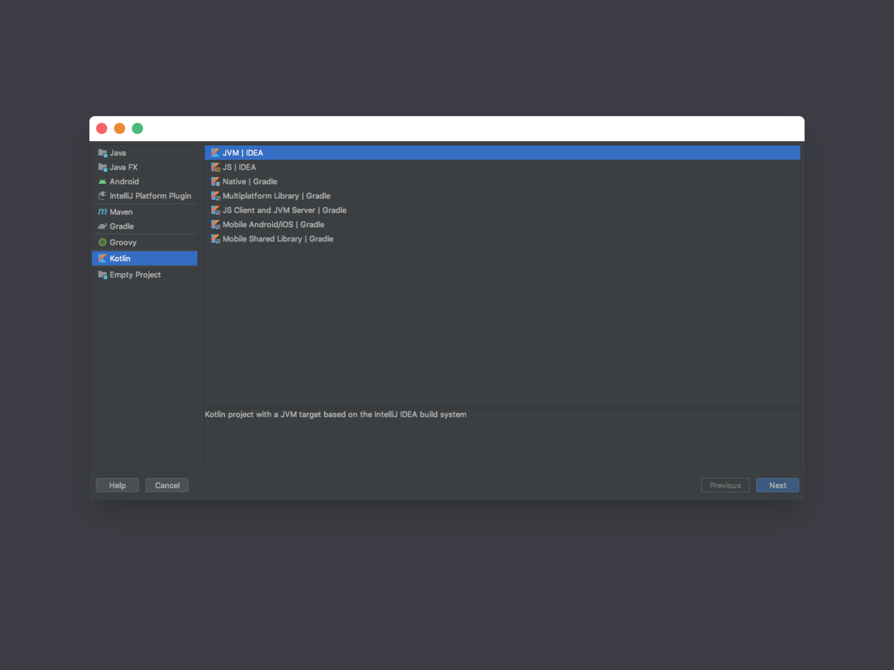
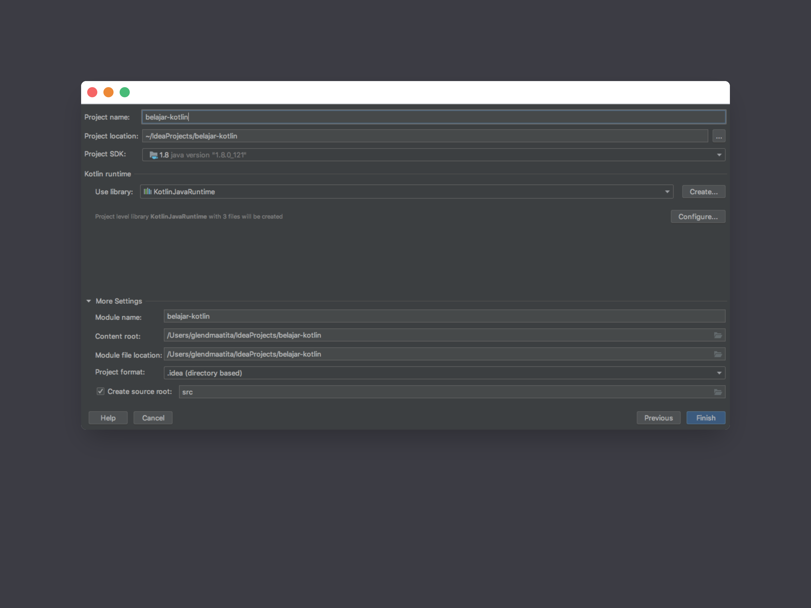

# Instalasi

Memulai menulis kode di Kotlin sangat mudah, yang perlu kita lakukan hanyalah menginstall JDK versi terbaru dan Intellij IDEA.

### Install JDK

Untuk dapat menggunakan Kotlin, terlebih dahulu install Java Development Kit atau biasa disingkat JDK, dapat didownload di [official website Oracle](https://www.oracle.com/java/technologies/javase-jdk14-downloads.html) . Pilih sesuai OS yang kita pakai dan install sampai selesai. 

Cek apakah instalasi berhasil dengan menjalankan perintah berikut di terminal

```bash
~$ java -version
Java(TM) SE Runtime Environment (build 1.8.0_121-b13)
Java HotSpot(TM) 64-Bit Server VM (build 25.121-b13, mixed mode)
```


Hasil dari perintah diatas bisa berbeda di komputer anda. Tergantung pada versi instalasi JDK yang anda lakukan.


### Intellij IDEA

Cara termudah dan paling disarankan untuk dapat segera memulai menulis kode Kotlin adalah men-download dan meng-install Intellij IDEA. Kita dapat men-download-nya [disini](https://www.jetbrains.com/idea/download/index.html). Ada versi _Community_ yang dapat kita gunakan secara _free._ Dengan menggunakan Intellij IDEA, otomatis Kotlin sudah terinstall dengan benar, plus kita dapat menggunakan fitur canggih IDE ini seperti _auto-completion, error detection, debugger,_ dsb.

Setelah berhasil meng-install Intellij IDEA, buka IDE tersebut sampai muncul tampilan seperti dibawah ini



Klick _Create New Project_ untuk ke halaman berikutnya



Pilih _Kotlin_ sebagai tipe project-nya dan _JVM \| IDEA_ sebagai target compile-nya. Kemudian klik _Next_



Masukkan nama project dan lokasinya, kemudian klik tombol _Finish_ dan selesai.

### Tambahan

Untuk alternatif lain selain Intellij IDEA, kita dapat menggunakan editor lainnya semisal Visual Studio dengan Kotlin plugin. Namun, sejauh ini menurut saya, Intellij IDEA adalah IDE terbaik untuk menulis kode Kotlin. Karena selain fiturnya yang lengkap, Kotlin sendiri dibuat oleh perusahaan yang sama dengan pembuat Intellij IDEA


